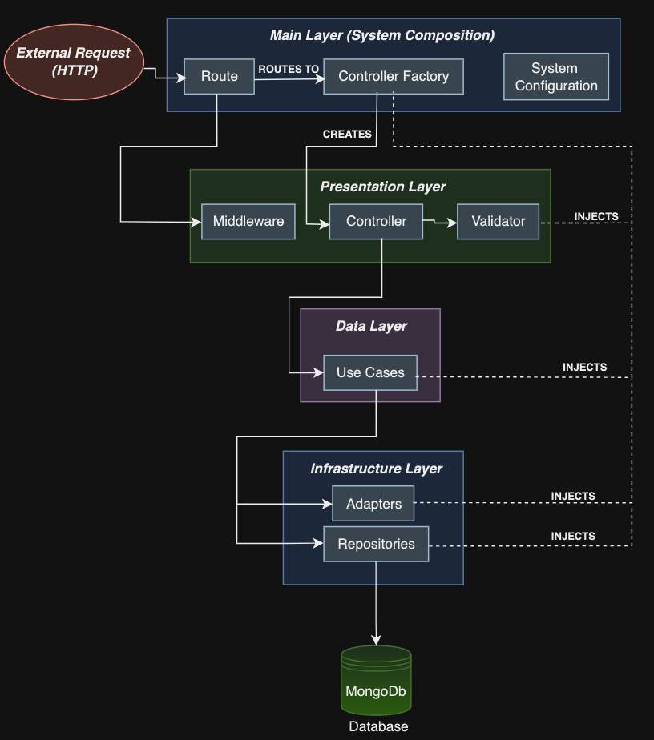

# Training Session Booking Application

A booking system built with Clean Architecture principles that allows users to schedule training sessions across multiple facilities.

## Features

- **Multi-facility Booking**: Book training sessions for:

  - Spa
  - Gym
  - Pool
  - Yoga

- **User Dashboard**:
  - Create and manage booking sessions
  - View upcoming and past bookings

### Backend Layer Structure



## Project Structure

```
client/                 # Interface implemented with React/TS and ReactQuery
src/
├── main/               # Factories, Composition Root and System Configuration
├── presentation/       # Controllers and Validators
├── data/               # Use Cases and Entities
└── infra/              # Repositories and Data Sources
```

## Technologies Used

- Frontend: Vite + React + TS
- Backend: NodeJS with Express
- Hasher: JWT token
- Cryptography: BCrypt
- Database: MongoDB

## Getting Started

### Prerequisites

```bash
# Add your prerequisites here
node -v
npm -v
```

### Installation

1. Clone the repository

```bash
git clone https://github.com/luispellizzon/Training-Session-Node-JS
```

2. Install dependencies

```bash
npm run install:all
```

3. Set up environment variables

```bash
cp .env.example .env
# Edit .env with your configuration
```

4. Start the development server

```bash
npm run dev
```

## API Documentation

### Sessions Endpoints

```
GET /api/sessions                   - List user sessions
POST /api/sessions                  - Create new session
PATCH api/sessions/:session_id      - Update user session
DELETE /api/sessions/:session_id    - Delete user session
```

### Users Endpoints

```
POST /api/login                     - Return user details and access token
POST /api/signup                    - Create new user
GET /api/me                         - Return user details and access token (reload action)
GET /api/users                      - Return list of all users (admin only)
POST /api/sessions                  - List of sessions from a user within a specified date range
```

### Admin Endpoints

```
POST /api/admin/sessions                     - Return list of all sessions grouped by users that booked the same day and time.
```
